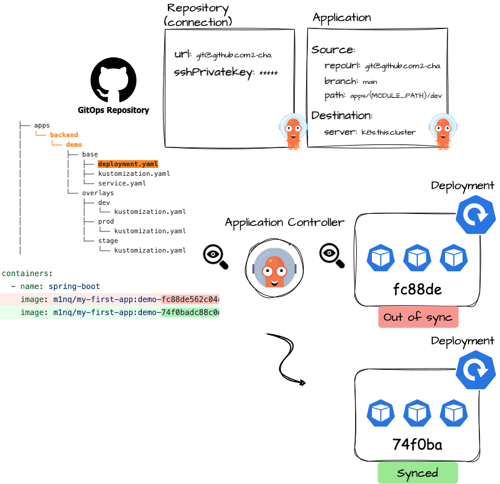

# GitOps using Tekton and Argo
---


## Requirements

- Kubernetes Cluster: Tekton과 ArgoCD가 배포될 클러스터가 필요합니다. 현재 kOps로 EC2에 배포되어 있습니다.
- [AWS Load Balancer Controller](https://kubernetes-sigs.github.io/aws-load-balancer-controller):
  Ingress 리소스를 ALB로 제공하기 위해 필요합니다. kOps의 add-on으로 설치되어 있습니다.

## Structure

```
├── apps
│   └── backend
│       └── demo
│           ├── base
│           │   ├── deployment.yaml
│           │   ├── kustomization.yaml
│           │   └── service.yaml
│           └── overlays
│               ├── dev
│               │   └── kustomization.yaml
│               ├── prod
│               │   └── kustomization.yaml
│               └── stage
│                   └── kustomization.yaml
├── bootstrap
│   ├── base
│   │   ├── argocd
│   │   │   └── kustomization.yaml
│   │   ├── kustomization.yaml
│   │   └── tektonci
│   │       ├── kustomization.yaml
│   │       └── tektonci-ns.yaml
│   └── overlays
│       └── default
│           └── kustomization.yaml
├── components
│   ├── argocd
│   │   ├── appsets
│   │   │   ├── demo-appset.yaml
│   │   │   └── kustomization.yaml
│   │   ├── ingresses
│   │   │   ├── argocd-ingress.yaml
│   │   │   └── kustomization.yaml
│   │   ├── kustomization.yaml
│   │   └── secrets
│   │       ├── config
│   │       ├── config.json
│   │       ├── id_rsa_gitops
│   │       ├── id_rsa_source
│   │       └── kustomization.yaml
│   └── tektonci
│       ├── ingresses
│       │   ├── kustomization.yaml
│       │   └── webhook-listener-ingress.yaml
│       ├── kustomization.yaml
│       ├── listeners
│       │   ├── kustomization.yaml
│       │   ├── listener-patch.json
│       │   └── webhook-listener.yaml
│       ├── pipelines
│       │   ├── clone-build-pipeline.yaml
│       │   └── kustomization.yaml
│       ├── rbacs
│       │   ├── kustomization.yaml
│       │   └── tekton-robot.yaml
│       ├── secrets
│       │   ├── config
│       │   ├── config.json
│       │   ├── id_rsa_gitops
│       │   ├── id_rsa_source
│       │   └── kustomization.yaml
│       └── triggers
│           ├── base
│           │   ├── kustomization.yaml
│           │   ├── tb-tt.yaml
│           │   └── trigger.yaml
│           └── overlays
│               ├── demo
│               │   └── kustomization.yaml
│               └── kustomization.yaml
└── core
    ├── ingresses
    │   ├── backend-gateway.yaml
    │   └── kustomization.yaml
    ├── kustomization.yaml
    └── secrets
        ├── config.json
        └── kustomization.yaml
```

| Directory  | Description                                                                                                                                                                                                                                                                                                                                         |
|------------|-----------------------------------------------------------------------------------------------------------------------------------------------------------------------------------------------------------------------------------------------------------------------------------------------------------------------------------------------------|
| bootstrap  | 클러스터 설정을 부트스트랩핑하는 항목입니다.<br />일반적으로 CRD 혹은 설치 매니페스트입니다. <br/><br />- `base` : 기본이 되는 설정입니다. ArgoCD, Tekton 매니페스트를 설치합니다.<br />- `overlays`: 클러스터 별 설정입니다.<br />현재 `overlays/default`는 `components` 및 `core`를 포함하고 있습니다.                                                                                                                             |
| core       | 클러스터 관련 YAML이 위치하는 곳입니다. 현재 `secrets`에 imagePullSecret이, `ingresses`에 백엔드 ALB 인그레스가 포함되어 있습니다.                                                                                                                                                                                                                                                      |
| components | GitOps 컨트롤러의 구성 요소가 있는 곳입니다.<br />Tekton, ArgoCD의 구성이 이 곳에 들어갑니다.<br /><br />기본적으로 리소스 접근을 위한 `RBAC`, 레포지토리 접근을 위한 `Secret`, 각 컨트롤러를 노출하기 위한 `Ingress` 등이 포함될 수 있습니다.<br /><br />- `tektonci`: 상기 기본 구성 외에, CI 파이프라인 및 웹훅 트리거 등으로 구성되어 있습니다. <br />- `argocd`: 기본 구성 외에, `ApplicationSet`, `AppProject` 등이 포함됩니다. 현재 `demo-appset`이 기본으로 구성되어 있습니다. |
| apps       | 배포 대상 워크로드가 있는 곳입니다.<br /><br />Tekton에 의해 deployment가 업데이트 되며,<br />ArgoCD에 의해 배포됩니다.<br />                                                                                                                                                                                                                                                        |

## How does it work?

### Tekton


> **Note** 이해의 편의를 위해 그림 및 설명에 일부 생략된 요소가 있습니다.

레포지토리 구조상 `Webhook`을 **단일 엔드포인트**로 수신하고 있기 때문에, <ins>Path 기반 라우팅을 할 수 없습니다</ins>.  
따라서 다음과 같은 프로세스를 거칩니다.

1. `EventListener`가 Source Repository의 Webhook을 수신합니다.
2. `EventListener`는 등록된 `Trigger`들에게 해당 Payload를 전달합니다.
3. 그림 상 `Filter` 역할을 하는 `Interceptor`가 Github Push Event의 <ins>모든 커밋</ins>에서 **수정/추가/삭제**된 파일을
   체크합니다.<br>미리 등록된 **MODULE_PATH**와
   일치하면 트리거가 동작합니다.
4. `Trigger`는 미리 작성된 `Pipeline`에 파라미터를 넘겨주며 실행시킵니다.

현재는 빌드 및 배포 대상이 되는 경로만 다르고 빌드 과정이 모두 같기 때문에,  
같은 `Pipeline`을 이용하며 **MODULE_PATH**만 파라미터로 넘겨 대상을 결정합니다.

### ArgoCD



#### ~~short-version~~

ArgoCD는 `Secret` 리소스를 이용하여 Repository에 대한 커넥션을 설정합니다. 또한, `Application` CRD를 정의하여 배포 대상 매니페스트를
지정합니다.

`Application`의 `Source`로 명시된 매니페스트를 확인하며,
`Destination`로 지정된 클러스터에서 해당 리소스를 모니터링합니다.

두 상태의 차이가 관찰되면 **Sync** 작업을 진행하게 됩니다.

**TODO**
<!-- TODO: AWS 구조 넣을지 말지? -->

## Usage?

### 기본 사용법

```bash
$ kubectl -k bootstrap/overlays/default
```
> 기본 구성을 진행합니다.
> Tekton, ArgoCD 설치와 더불어 기본 CI/CD 파이프라인 워크플로가 구축됩니다.


#### ArgoCD 마저 설정하기!
```bash
$ kubectl patch svc argocd-server -n argocd -p '{"spec": {"type": "NodePort"}}'
```
> ArgoCD Server는 기본적으로 `ClusterIP` 타입의 서비스로 구성되기 때문에,
> ALB를 이용하기 위하여 `NodePort` 타입으로 수정합니다. 

```yaml
# argocd-ingress.yaml
...
    alb.ingress.kubernetes.io/listen-ports: '[{"HTTP":80}]'
...
  name: argocd
  namespace: argocd

...
          backend:
              service:
                name: argocd-server
                port:
                  number: 80
```
> 기본적으로 HTTP를 이용하도록 `Ingress`가 구성되어 있습니다.
> tls를 적용하고 backend 포트를 443으로 설정하는 것이 권장됩니다.
> **Note** 
> ArgoCD Server를 `insecure` 모드로 설정해야 HTTP를 이용할 수 있습니다.
> ArgoCD CLI는 gRPC를 이용하기 때문에, HTTPS 설정이 필요합니다.
```bash
$ kubectl patch deploy -n argocd argocd-server --type json -p '[ { "op": "add", "path": "/spec/template/spec/containers/0/command/-", "value": "--insecure" } ]'
```

이제 Web UI로 ArgoCD에 접근할 수 있습니다!


### 새로운 애플리케이션 추가하기

#### 1. 트리거 및 이벤트리스너 구성 


Tekton 트리거에서 `MODULE_PATH`는 
1. 웹훅 페이로드에 명시된 변경된 파일 경로
2. GitOps 레포지토리 `apps/` 하위의 매니페스트 경로
를 나타냅니다. (두 항목의 이름이 일치해야 합니다.)

현재 배포 대상은 스프링 부트 애플리케이션뿐이기 때문에,  
기존 스프링 빌드 파이프라인을 재사용하기 위해,  
트리거의 `MODULE_PATH`만 **Parameterize** 하는 방식으로 진행됩니다.

소스 레포지토리에 `user-service` 애플리케이션이 추가된 시나리오를 가정하겠습니다.  
기본 트리거를 템플릿처럼 사용하기 위해 [kustomize](https://kubernetes.io/docs/tasks/manage-kubernetes-objects/kustomization/)를 사용합니다.


```yaml
# components/tektonci/triggers/overlays/user/kustomization.yaml

apiVersion: kustomize.config.k8s.io/v1beta1
kind: Kustomization
namespace: tektonci
resources:
  - ../../base

patches:
  - target:
      group: triggers.tekton.dev
      version: v1beta1
      kind: Trigger
      name: trigger 

    patch: |
      - op: replace
        path: /metadata/name
        value: "user-trigger" # 1
      - op: replace
        path: /spec/interceptors/0/params/0/value/0/expression
        value: "string('backend/user')" # 2
```
> 단순히 기본 트리거의 `1) name`, `2) MODULE_PATH`만 변경하는 패치입니다.

```yaml
# components/tektonci/triggers/overlays/kustomization.yaml
apiVersion: kustomize.config.k8s.io/v1beta1
kind: Kustomization
namespace: tektonci
resources:
  - demo
  - user   # Add new Trigger 
```
> 모든 트리거를 한번에 배포하기 위해, overlays 디렉토리에서 `user` 디렉토리를 추가해줍니다.

[`demo-trigger`가 `webhook-listener`에 추가된 방식](listener-patch.md)처럼,  
`user-trigger`를 추가하도록 패치 파일도 편집합니다.

```json
[
  {
    "op": "add",
    "path": "/spec/triggers/-",
    "value": {
      "triggerRef": "demo-trigger"
    }
  },
    {
    "op": "add",
    "path": "/spec/triggers/-",
    "value": {
      "triggerRef": "user-trigger"
    }
  }
]
```
> `components/tektonci/listeners/listener-patch.json`


```bash
$ kubectl apply -k components/tektonci/listeners
$ describe el -n tektonci | grep "Trigger Ref" 
>    Trigger Ref:  trigger
>    Trigger Ref:  demo-trigger
>    Trigger Ref:  user-trigger
```
> 이제 `webhook-listener`는
> `backend/dummy`, `backend/demo`, `backend/user` 에 대한 트리거를 참조하게 됩니다!


#### 2. 매니페스트 및 ArgoCD Application 구성

새로운 `user-trigger`는 `MODULE_PATH`를 CI/CD 파이프라인에게 파라미터로 넘깁니다.
파이프라인의 마지막은 현재 GitOps 레포지토리의 매니페스트를 업데이트하는 단계입니다.

업데이트할 `backend/user`의 매니페스트가 현재 레포지토리에 존재하지 않습니다.
`apps/backend/demo` 디렉토리를 참조하여,  
`user-service`의 `Deployment`, `Service` 등 매니페스트를 작성해주어야 합니다.  
  
<br></br>
이제 마지막 단계입니다.  
ArgoCD는 아직 새로 구성된 `user-service` 매니페스트에 대해 알지 못합니다.  
`Application` 리소스를 작성하여, ArgoCD가 이를 모니터링하도록 합니다.

```yaml
# components/argocd/appsets/user-appset.yaml
...
      project: default
      source:
        repoURL: git@github.com:2-cha/gitops-config.git
        targetRevision: main
        path: apps/backend/user/overlays/{{env}} # Here
...
```
> `demo-appset.yaml`을 참고하여 나머지 부분도 적절하게 변경해줍니다.

```yaml
# components/argocd/appsets/kustomization.yaml
apiVersion: kustomize.config.k8s.io/v1beta1
kind: Kustomization
namespace: argocd
resources:
  - demo-appset.yaml
  - user-appset.yaml
```
> 한 번에 관리할 수 있도록 리소스를 추가합니다.

```bash
$ kubectl apply -k components/argocd/appsets
```

이제 ArgoCD 는 `apps/backend/user/...` 의 매니페스트를 쿠버네티스 클러스터와 레포지토리 상에서 모니터링합니다!


# TODO

- [x] apply CI to main branch
- [x] complete README
    - [x] How to add new application
- [x] apply autoscaling
- [x] deploy prometheus, grafana
- [x] deploy Elastic stack
- [ ] <ins>tekton GC</ins>
- [ ] <ins>inject configurations</ins>
- [ ] automate gradual promotion
- [ ] apply unit test, sonarqube


