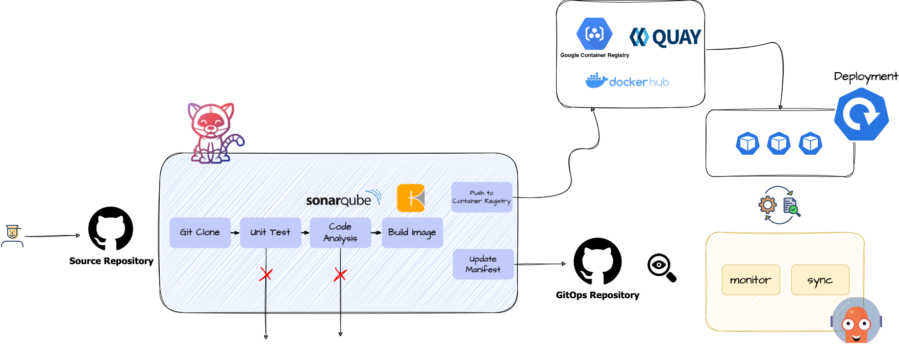
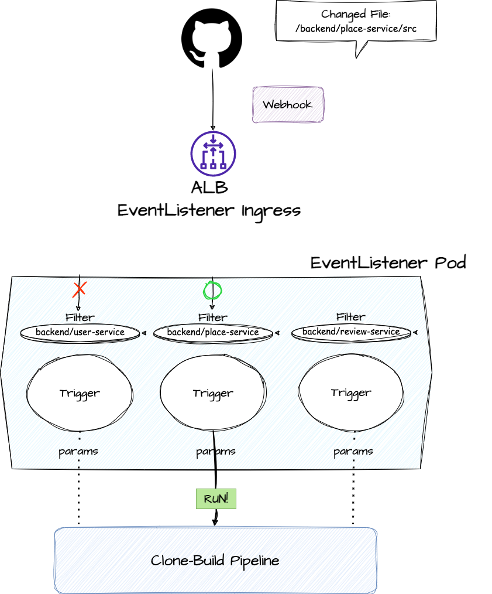

# GitOps using Tekton and Argo
---



## Requirements

- Kubernetes Cluster: Tekton과 ArgoCD가 배포될 클러스터가 필요합니다. 현재 kOps로 EC2에 배포되어 있습니다.
- [AWS Load Balancer Controller](https://kubernetes-sigs.github.io/aws-load-balancer-controller):
  Ingress 리소스를 ALB로 제공하기 위해 필요합니다. kOps의 add-on으로 설치되어 있습니다.

## Structure

```
├── apps
│   └── backend
│       └── demo
│           ├── base
│           │   ├── deployment.yaml
│           │   ├── kustomization.yaml
│           │   └── service.yaml
│           └── overlays
│               ├── dev
│               │   └── kustomization.yaml
│               ├── prod
│               │   └── kustomization.yaml
│               └── stage
│                   └── kustomization.yaml
├── bootstrap
│   ├── base
│   │   ├── argocd
│   │   │   └── kustomization.yaml
│   │   ├── kustomization.yaml
│   │   └── tektonci
│   │       ├── kustomization.yaml
│   │       └── tektonci-ns.yaml
│   └── overlays
│       └── default
│           └── kustomization.yaml
├── components
│   ├── argocd
│   │   ├── appsets
│   │   │   ├── demo-appset.yaml
│   │   │   └── kustomization.yaml
│   │   ├── ingresses
│   │   │   ├── argocd-ingress.yaml
│   │   │   └── kustomization.yaml
│   │   ├── kustomization.yaml
│   │   └── secrets
│   │       ├── config
│   │       ├── config.json
│   │       ├── id_rsa_gitops
│   │       ├── id_rsa_source
│   │       └── kustomization.yaml
│   └── tektonci
│       ├── ingresses
│       │   ├── kustomization.yaml
│       │   └── webhook-listener-ingress.yaml
│       ├── kustomization.yaml
│       ├── listeners
│       │   ├── kustomization.yaml
│       │   ├── listener-patch.json
│       │   └── webhook-listener.yaml
│       ├── pipelines
│       │   ├── clone-build-pipeline.yaml
│       │   └── kustomization.yaml
│       ├── rbacs
│       │   ├── kustomization.yaml
│       │   └── tekton-robot.yaml
│       ├── secrets
│       │   ├── config
│       │   ├── config.json
│       │   ├── id_rsa_gitops
│       │   ├── id_rsa_source
│       │   └── kustomization.yaml
│       └── triggers
│           ├── base
│           │   ├── kustomization.yaml
│           │   ├── tb-tt.yaml
│           │   └── trigger.yaml
│           └── overlays
│               ├── demo
│               │   └── kustomization.yaml
│               └── kustomization.yaml
└── core
    ├── ingresses
    │   ├── backend-gateway.yaml
    │   └── kustomization.yaml
    ├── kustomization.yaml
    └── secrets
        ├── config.json
        └── kustomization.yaml
```

| Directory  | Description                                                                                                                                                                                                                                                                                                                                         |
|------------|-----------------------------------------------------------------------------------------------------------------------------------------------------------------------------------------------------------------------------------------------------------------------------------------------------------------------------------------------------|
| bootstrap  | 클러스터 설정을 부트스트랩핑하는 항목입니다.<br />일반적으로 CRD 혹은 설치 매니페스트입니다. <br/><br />- `base` : 기본이 되는 설정입니다. ArgoCD, Tekton 매니페스트를 설치합니다.<br />- `overlays`: 클러스터 별 설정입니다.<br />현재 `overlays/default`는 `components` 및 `core`를 포함하고 있습니다.                                                                                                                             |
| core       | 클러스터 관련 YAML이 위치하는 곳입니다. 현재 `secrets`에 imagePullSecret이, `ingresses`에 백엔드 ALB 인그레스가 포함되어 있습니다.                                                                                                                                                                                                                                                      |
| components | GitOps 컨트롤러의 구성 요소가 있는 곳입니다.<br />Tekton, ArgoCD의 구성이 이 곳에 들어갑니다.<br /><br />기본적으로 리소스 접근을 위한 `RBAC`, 레포지토리 접근을 위한 `Secret`, 각 컨트롤러를 노출하기 위한 `Ingress` 등이 포함될 수 있습니다.<br /><br />- `tektonci`: 상기 기본 구성 외에, CI 파이프라인 및 웹훅 트리거 등으로 구성되어 있습니다. <br />- `argocd`: 기본 구성 외에, `ApplicationSet`, `AppProject` 등이 포함됩니다. 현재 `demo-appset`이 기본으로 구성되어 있습니다. |
| apps       | 배포 대상 워크로드가 있는 곳입니다.<br /><br />Tekton에 의해 deployment가 업데이트 되며,<br />ArgoCD에 의해 배포됩니다.<br />                                                                                                                                                                                                                                                        |

## How does it work?

### Tekton


> 이해의 편의를 위해 그림 및 설명에 일부 생략된 요소가 있습니다.

레포지토리 구조상 `Webhook`을 **단일 엔드포인트**로 수신하고 있기 때문에, <ins>Path 기반 라우팅을 할 수 없습니다</ins>.  
따라서 다음과 같은 프로세스를 거칩니다.

1. `EventListener`가 Source Repository의 Webhook을 수신합니다.
2. `EventListener`는 등록된 `Trigger`들에게 해당 Payload를 전달합니다.
3. 그림 상 `Filter` 역할을 하는 `Interceptor`가 Github Push Event의 <ins>모든 커밋</ins>에서 **수정/추가/삭제**된 파일을
   체크합니다.<br>미리 등록된 **MODULE_PATH**와
   일치하면 트리거가 동작합니다.
4. `Trigger`는 미리 작성된 `Pipeline`에 파라미터를 넘겨주며 실행시킵니다.

현재는 빌드 및 배포 대상이 되는 경로만 다르고 빌드 과정이 모두 같기 때문에,  
같은 `Pipeline`을 이용하며 **MODULE_PATH**만 파라미터로 넘겨 대상을 결정합니다.

### ArgoCD

**TODO**
<!-- TODO: AWS 구조 넣을지 말지? -->

## How to use?

**TODO**
<!-- TODO 
### 새 배포 대상 추가하기
#### overlay `Trigger`
    Spring Boot 앱이라면 MODULE_PATH만 패치하고, Pipeline 재사용
#### patch `EventListener`
    `EventListener`에 새 `Trigger` 추가
#### apps/<MODULE_PATH> 에 `Deploy`, `Service` 추가
    source repository와 일치
#### Application(Set) 추가 
--> 

## Examples

**TODO**

# TODO

- [ ] apply CI to main branch
- [ ] deploy some app instead of demo-service
- [ ] automate gradual promotion
- [ ] deploy prometheus, grafana
- [ ] deploy Elastic stack
- [ ] apply unit test, sonarqube
- [ ] apply autoscaling
- [ ] complete README
    - [ ] How to add new application
    - [ ] Deployment, Service and Ingress structure
    - else?